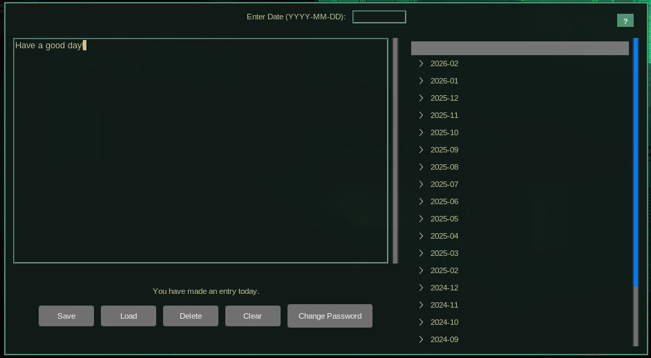

# Encrypted Journal
A cross-platform encrypted journal application built with Python, Tkinter, and the `cryptography` library. Securely write, save, load, and delete journal entries with AES-GCM encryption, featuring a modern GUI, spell checking, and session timeout for added security. Entries are stored in a compressed JSON file (`journal.json.gz`) that works seamlessly across Windows, macOS, and Linux.

# Features
- **Secure Encryption**: Entries are encrypted using AES-GCM with keys derived via Scrypt from your password, using cryptographically secure salts and nonces.
- **Save and Load Entries**: Encrypt and save entries to `journal.json.gz`, and decrypt them by date using a treeview interface.
- **Delete Entries**: Remove specific entries with confirmation prompts.
- **Spell Checking**: Real-time spell checking with right-click suggestions (powered by `pyenchant`).
- **Session Security**: 5-minute session timeout requires re-entering your password, with secure password cleanup from memory.
- **Cross-Platform**: Works on Windows, macOS, and Linux with consistent file handling and permissions.
- **Theming**: Toggle between light and dark themes using the `azure.tcl` theme file.
- **Days Since Last Entry**: Displays the time since your last journal entry.
- **Clear Entry**: Reset the text and date fields with a single click.

# Requirements
- Python 3.11+
- Dependencies:
  - `cryptography` (for encryption/decryption)
  - `pyenchant` (for spell checking)
  - `keyring` (optional, for saved passwords via system keyring)
  - `pywin32` (optional, for Windows file permissions)

# Installation
1. Clone the Repository
    cd encrypted-journal



# Example JSON File Structure
[
    {"date": "2025-02-20", "entry": "base64_encoded_encrypted_data"},
    {"date": "2025-02-21", "entry": "another_base64_encoded_encrypted_data"}
]

# Smoke Test
Run the local smoke test to verify core journal flows (save, load, delete, and password change):

```bash
python scripts/smoke_test.py
```

# Storage + Keyring Options
Default journal location now follows XDG conventions:
- `~/.local/share/encrypted-journal/journal.json.gz` (or `$XDG_DATA_HOME/encrypted-journal/journal.json.gz`)

Compatibility behavior:
- If a legacy `journal.json.gz` exists in the app directory, it is still used automatically.

Environment overrides:
- `ENCRYPTED_JOURNAL_FILE=/custom/path/journal.json.gz` to force a specific file location.
- `ENCRYPTED_JOURNAL_USE_KEYRING=1` to enable optional system keyring integration for remembered passwords.
- `ENCRYPTED_JOURNAL_KEYRING_USER=<name>` to customize the keyring account key.

# Textual TUI
A terminal-first alternative frontend, `journal_tui.py`, built with [Textual](https://textual.textualize.io/). It coexists with the Tkinter GUI (`secure_journal.py`) rather than replacing it, and shares the same journal file, on-disk format, and encryption via `journal_core.py` — entries created in one frontend show up in the other. It respects the same `ENCRYPTED_JOURNAL_FILE`, `ENCRYPTED_JOURNAL_USE_KEYRING`, and `ENCRYPTED_JOURNAL_KEYRING_USER` env vars described above.

Install the extra dependency, then launch it:
```bash
pip install -r requirements-tui.txt
python journal_tui.py
```

Key bindings:
- `n` — new entry
- `v` / `enter` — view/edit the selected entry
- `d` — delete the selected entry (with a Yes/No confirmation)
- `l` — lock now (clears the in-memory password, returns to the unlock screen)
- `q` — quit
- `ctrl+s` — save an entry
- `escape` — cancel/discard and return to the entry list

Session lock: `ENCRYPTED_JOURNAL_TUI_LOCK_SECONDS` (default `300`, i.e. 5 minutes) sets an inactivity auto-lock. After that many seconds without a tracked action, the in-memory password is cleared; the next action that needs decryption re-prompts for the password in place, without discarding unsaved edits. The `l` key triggers the same lock manually, independent of the timer.

Password rotation and spell checking are GUI-only for now; the TUI doesn't implement either yet.

# Arch / Omarchy Packaging
This repo includes Arch packaging files at `packaging/arch/` so the app can be published to AUR and discovered from Omarchy package search tools.

## Build Locally (Arch)
```bash
cd packaging/arch
makepkg -si
```

## Publish To AUR
1. Create an AUR package repo named `encrypted-journal-git`.
2. Copy `PKGBUILD`, `.SRCINFO`, `encrypted-journal.desktop`, and `encrypted-journal-launcher` from `packaging/arch/`.
3. Commit and push to the AUR repo.
4. After AUR indexing, users can search/install it from Omarchy package installer UIs.

# Contributing
Contributions are welcome! Please feel free to submit a Pull Request.

## Creating a Pull Request
If you are new to GitHub pull requests, follow these steps to share your changes and test them before merging:

1. **Create a new branch** for your change so the `main` (or `omarchy`) branch stays clean:
   ```bash
   git checkout -b feature/refresh-theme
   ```
2. **Stage and commit your work** once it is ready:
   ```bash
   git add secure_journal.py
   git commit -m "Describe your change"
   ```
3. **Push the branch to GitHub**:
   ```bash
   git push -u origin feature/refresh-theme
   ```
4. **Open a pull request** on GitHub by selecting your branch as the source and the `omarchy` branch (or another target) as the destination. Describe the change, include testing notes, and submit the PR.
5. **Test the PR locally** by checking out the branch from GitHub (`git fetch origin pull/<id>/head:pr-test && git checkout pr-test`). This lets you verify the changes before approving and merging them into the `omarchy` branch.
6. **Merge the PR** once testing looks good. GitHub will offer a merge button (e.g., “Merge pull request”) after approvals and status checks pass. Choose the merge strategy that fits your workflow.

These steps create a temporary review branch that teammates can pull down to try out the update (such as the automatic Omarchy theme refresh) before the code lands in the shared `omarchy` branch.

# License
This project is licensed under the MIT License. See the LICENSE file for more details.


